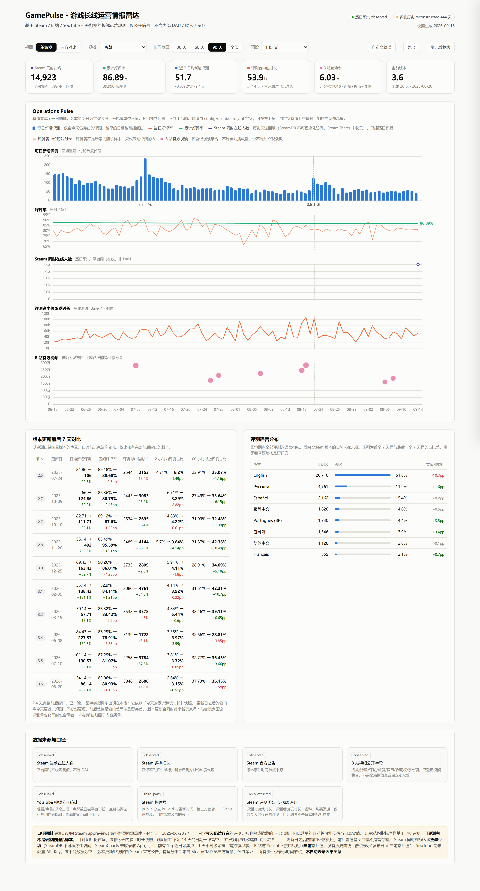

# GamePulse · 游戏长线运营情报雷达

用公开数据观察长线运营游戏的版本节奏、玩家结构与传播表现。
当前跟踪《鸣潮》《绝区零》《异环》三款游戏的 Steam 版本与官方视频。



---

## 这个看板回答什么

不是「今天有多少人在玩」——那是公开数据回答不了的。它回答的是：

| 问题 | 用什么回答 |
|---|---|
| 版本更新后声量变了多少 | 版本更新日前后各 7 天的新增评测对比 |
| 来的是什么人 | 评测者写评测时的游戏时长分布：2 小时内 vs 100 小时以上 |
| 玩家来源结构在变吗 | 评测语种构成的 7 天分桶变化 |
| 官方视频是真的火还是只是推荐位给得多 | 互动率（点赞+投币+收藏）/ 播放，跨视频可比 |
| 在线是盘子变大还是采样撞上高峰 | 小时级采样出的日峰值 / 日谷值 / 峰谷比 |
| 版本到底哪天更新的 | Steam 官方公告 + SteamCMD 构建号双重证据 |

一条贯穿性的原则：**时间上相邻不等于因果。** 所有事件只标时间节点。

---

## 快速开始

```powershell
pip install -r requirements.txt

python collect.py                            # 采集 + 生成快照
python pipeline/build_dashboard_config.py    # 编译并校验轨道配置
python -m http.server 8770                   # 必须在项目根目录启动
```

访问 <http://127.0.0.1:8770/dashboard/index.html>

页面通过 `../data/*.json` 读取数据，因此 **HTTP 服务必须从项目根目录启动**，
而不是 `dashboard/` 子目录。

### 自动更新（Windows 本机）

```powershell
powershell -ExecutionPolicy Bypass -File scripts\register-tasks.ps1
powershell -ExecutionPolicy Bypass -File scripts\register-tasks.ps1 -Status
powershell -ExecutionPolicy Bypass -File scripts\register-tasks.ps1 -Remove
```

注册两个任务：每日 13:20 全量采集，每小时第 5 分钟采一次在线人数。

**为什么是本机而不是 GitHub Actions**：Actions 的 runner 在境外。B 站接口对
境外 IP 有风控（实测搜索接口直接返回 HTTP 412），Steam 商店接口也会按 IP 跳区，
会导致同一个指标在不同日子来自不同地区口径。数据一致性比「云端自动跑」重要。
代价是关机时段会漏采——漏采的日期在曲线上是断点，由质量检查标出来，
不插值、不填 0。

### YouTube（可选，免费）

未配置 API Key 时 YouTube 采集会打印申请指引并跳过，不影响其他链路。

```powershell
# https://console.cloud.google.com/ → 新建项目 → 启用 YouTube Data API v3 → 创建 API 密钥
setx YOUTUBE_API_KEY "你的密钥"      # 计划任务读不到 set 设的临时变量，必须用 setx

python collectors/youtube_discover.py --resolve                  # handle → channel_id
python collectors/youtube_discover.py --since 2026-06-01         # 列出候选
python collectors/youtube_discover.py --since 2026-06-01 --append
```

密钥只从环境变量读取，不写进任何配置或数据文件。

---

## 自定义看板

轨道不写死在代码里，来自 `config/dashboard.yml`：

```yaml
- id: bili_engagement
  title: B 站互动率
  adapter: video_scatter
  path: bilibili.videos
  field: engagement
  from_rates: true
  chart: scatter
  color: slot3
  height: 110
  unit: percent
```

加一个指标只改这个文件，不动图表代码。`build_dashboard_config.py` 会**逐条验证
path/field 能在真实快照里取到值**——把 `new_reviews` 写成 `new_review` 会在构建时
报错，而不是在页面上默默渲染一条空轨道让人以为「这个指标没数据」。

页面右上角「自定义轨道」可以增删轨道、调整顺序与高度；「预设」提供
默认 / 玩家结构 / 传播端 / 在线盘四套组合。设置存在 localStorage，
也可以通过「导出 → 复制当前视图链接」把当前视图分享出去（URL 优先于本地设置）。

导出：按日期的 CSV、视频明细 CSV、综合图 PNG。

只有在 `app.js` 的 `ADAPTERS` 里新增一种**取数方式**时才需要改代码；
新增 adapter 必须同步登记到 `build_dashboard_config.py` 的 `ADAPTER_SHAPES`，
否则配置校验会拒绝使用它。

---

## 数据源可用性（实测）

| 数据 | 来源 | 状态 |
|---|---|---|
| 当前同时在线 | `GetNumberOfCurrentPlayers` | 可用 |
| 评测汇总 | `appreviews` | 可用 |
| 评测明细（时长/语种/渠道） | `appreviews` 游标翻页回填 | 可用 |
| 版本公告 | `ISteamNews/GetNewsForApp` | 可用 |
| 构建号与更新时间 | `api.steamcmd.net` | 可用（第三方镜像） |
| 商店价格 | `appdetails` | **不可用**（返回 `success:false`）|
| 历史在线曲线 | SteamDB | **不可用**（403 / API 410）|
| 历史在线曲线 | SteamCharts | **不可用**（未收录这几个 App）|
| B 站视频七项计数 | `x/web-interface/view` | 可用 |
| B 站账号核验 | `x/web-interface/card` | 可用（无需 Cookie）|
| B 站视频搜索 | `x/web-interface/search/type` | **不可用**（HTTP 412 风控）|
| B 站官方视频发现 | `x/web-interface/archive/related` + mid 过滤 | 可用（半自动）|
| YouTube 视频统计 | `videos.list` | 可用（需免费 Key）|
| YouTube 官方视频发现 | 频道 uploads 播放列表 | 可用（**全自动**）|

三款均为免费游戏，价格与折扣轨道无内容，字段保留给后续付费游戏。

候选游戏的可用性一律用脚本实测，不靠记忆断言：

```powershell
python tools/probe_candidates.py
```

---

## 一个必须先说清楚的结构性事实

三款游戏 Steam 评测的简体中文占比：**绝区零 0.4%、鸣潮 1.4%、异环 0.2%**。

**Steam 侧是海外盘，B 站侧是国内盘，不是同一批人。**
所以看板不把两者合成一个「综合热度」。这也正是接入 YouTube 的理由：
YouTube 观众与 Steam 玩家同源，两者放在一起才有讨论因果的人群基础。

---

## 口径说明

- **Steam 在线人数**：平台同时在线观测值，不是 DAU，也不是玩家总数。
- **新增评测**：讨论热度代理，不等于讨论量或玩家数。
- **评测历史为回填重建**：只包含今天仍然存在的评测，被删除或隐藏的不会出现，
  因此越早的日期越可能低估当日真实值。该序列标记为 `reconstructed`，
  与逐日采集的 `observed` 分开存放，不连成同一条线。
- **评测者不是玩家的随机样本**：写评测的人本身偏向重度或极端体验，
  所有玩家结构指标只代表评测者。
- **「评测后仍在玩」有观测窗口偏差**：`playtime_forever` 是今天的累计快照，
  新评测的观测窗口必然更短。实测绝区零 90 天前那批是 90.4%、今天这批是 21.1%，
  差异 100% 来自窗口长度。因此窗口不足 14 天的日期一律留空，
  且该指标被硬性排除在版本前后对比之外——更新日之后的窗口永远离今天更近，
  放进对比表等于系统性地造出「每次更新后留存都下降」。
- **Steam 在线历史无法回填**，只能自开始采集起逐日积累。
- **B 站/YouTube 播放量**：接口只返回当前累计值，没有历史曲线。图中散点表示
  「发布日 × 当前累计值」，不是当日播放量，也不是全站播放量或独立观众数。
- **YouTube 点踩数已被平台下线**；点赞与评论可被创作者隐藏，隐藏时记 `null` 不记 0。
- **首 7 日爬坡曲线**只对「发布当天就已进采集表」的视频成立，
  事后补登记的视频标 `ramp.available=false`，不与之同图比较。
- **构建号来自第三方镜像**，标 `third_party`，仅作官方公告的旁证。
- **事件仅表示时间节点，不自动表示因果关系。**

---

## 目录

```text
config/games.yml                  游戏与 Steam App ID
config/bilibili_videos.yml        按角色/版本登记并核验的 BV 号
config/youtube_videos.yml         官方频道与自动发现的视频
config/dashboard.yml              轨道目录（看板自定义的来源）

collectors/common.py              配置、HTTP、幂等写入、采集日志
collectors/steam.py               在线人数、评测汇总、价格、官方公告
collectors/steam_online.py        小时级在线采样
collectors/steam_build.py         SteamCMD 构建号
collectors/steam_reviews_backfill.py  评测明细回填（游标翻页）
collectors/bilibili.py            七项公开计数
collectors/bilibili_discover.py   官方新视频半自动发现
collectors/youtube.py             YouTube 视频统计
collectors/youtube_discover.py    频道解析与新视频自动发现

pipeline/metrics.py               好评率、增量、互动率、日峰谷、指数化
pipeline/review_profile.py        玩家结构：时长分布、语种构成、版本前后对比
pipeline/quality.py               缺天、过期、字段缺失、倒退、owner 校验
pipeline/build_snapshot.py        组装 dashboard 快照
pipeline/build_dashboard_config.py 编译并校验轨道配置
pipeline/build_compare.py         三方对比数据

dashboard/index.html + app.js     配置驱动的多轨道综合图
dashboard/compare.js              三方对比视图

scripts/register-tasks.ps1        注册/注销 Windows 计划任务
tools/probe_candidates.py         候选游戏 Steam 可用性实测
tools/shoot.mjs                   看板视觉自检：截图 + 空轨道检测
tests/                            指标、事件、玩家结构的单元测试
```

---

## 维护

```powershell
python collect.py                                     # 每日采集（幂等，可补跑）
python collectors/steam_reviews_backfill.py --game zenless_zone_zero
python collectors/bilibili_discover.py --game zenless_zone_zero --since 2026-09-01
python -m unittest discover -s tests -v
node tools/shoot.mjs --all                            # 需先启动 http 服务
```

评测回填不需要每天跑，版本更新后跑一次即可刷新历史。

`bilibili_discover.py` 与 `youtube_discover.py` **只输出候选，不自动断言版本归属**——
角色 PV 通常早于版本更新日 5–12 天发布，按日期机械归类必然出错，
版本归属需要人工确认。

`tools/shoot.mjs` 用真实浏览器渲染页面并统计每条轨道的数据点数量。
配置驱动的前端最容易出的问题不是崩溃，而是某条轨道静默画空——
页面照样 200、照样好看，只是那条线不见了。

---

## 已知限制

- 逐日在线序列数据点仍很少，正式趋势复盘应在连续采集 30 天以上再做；
  小时级采样自 2026-09-14 起才开始积累。
- B 站视频为人工登记，不覆盖全部官方内容，也不含创作者视频。
- YouTube 未配置 Key 时该平台数据为空。
- 仅跟踪 Steam 单一平台，不代表游戏的全平台表现，也不能外推到国服。
- Reddit / Discord / X 未接入：X 自 2026-02 起对新开发者只有按量付费、无免费层；
  Reddit 新 OAuth client 需人工审批且官方已宣布收紧公共 API；
  Discord 无 Bot 时只能拿到近似在线数且无历史。三者性价比均不足。

---

## 合规

只使用公开可访问数据。不保存 Cookie、账号或 Authorization header；
API Key 仅从环境变量读取；不破解验证码、不绕过登录、不做反检测；
遵守公开接口频率与平台服务条款。

本项目是独立研究原型，不代表任何平台或游戏公司的官方系统。
